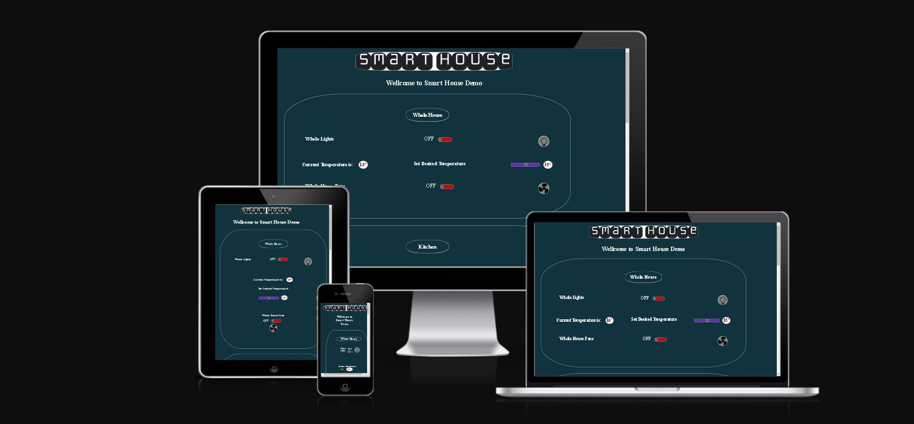

  # Smart House Demo

The Smart House Dashboard Demo is a web-based application that showcases the potential of controlling and monitoring various aspects of a smart home from a single interface. The dashboard provides users with the ability to manage lighting, temperature, and appliances in different sections of the home in an efficient and convenient way. The user interface is designed to be intuitive and easy to use. Please note that this is a demo version of the Smart House Dashboard and does not provide full functionality or control over a real smart home.

[View the live project here](https://fazel-hosseinzadeh.github.io/smartHouse/index.html)

---

##  Table of Contents

1. [Project Goals](#project-goals)
    - User Goals
    - Site Owner Goals

2. [User Experience](#user-experience)

3. [Design](#design)

4. [Technologies Used](#technologies-used)

5. [Features](#features)

6. [Testing](#validation)

7. [Bugs](#Bugs)

8. [Deployment](#deployment)

9. [Credits](#credits)

10. [Acknowledgments](#acknowledgments)

---

## 1.  Project Goals 

### User Goals
-   Control the lighting, temperature, and fan in various rooms of a smart house.
-   Access an intuitive interface to manage household utilities effectively.
-   Monitor the current temperature and set the desired temperature easily.

### Site Owner Goals
-   Showcase the functionality of a smart home system.
-   Demonstrate the integration of various controls in different rooms.
-   Provide a seamless user experience through a well-designed interface.

[Go Back to Table of Contents](#table-of-contents)

---

## 2.   User Experience

[Go Back to Table of Contents](#table-of-contents)

---
## 3.   Design

[Go Back to Table of Contents](#table-of-contents)

---
## 4.   Technologies Used

[Go Back to Table of Contents](#table-of-contents)

---
## 5.   Features

[Go Back to Table of Contents](#table-of-contents)

---
## 6.   Testing

[Go Back to Table of Contents](#table-of-contents)

---
## 7.   Bugs

[Go Back to Table of Contents](#table-of-contents)

---
## 8.   Deployment

[Go Back to Table of Contents](#table-of-contents)

---
## 9.   Credits 

[Go Back to Table of Contents](#table-of-contents)

---
## 10.  Acknowledgments

[Go Back to Table of Contents](#table-of-contents)

---

