  # Smart House Demo

The Smart House Dashboard Demo is a web-based application that showcases the potential of controlling and monitoring various aspects of a smart home from a single interface. The dashboard provides users with the ability to manage lighting, temperature, and appliances in different sections of the home in an efficient and convenient way. The user interface is designed to be intuitive and easy to use. Please note that this is a demo version of the Smart House Dashboard and does not provide full functionality or control over a real smart home.

[View the live project here](https://fazel-hosseinzadeh.github.io/smartHouse/index.html)

---

##  Table of Contents

1. [Project Goals](#project-goals)

2. [User Experience](#user-experience)

3. [Design](#design)

4. [Technologies Used](#technologies-used)

5. [Features](#features)

6. [Testing](#testing)

7. [Bugs](#bugs)

8. [Deployment](#deployment)

9. [Credits](#credits)

10. [Acknowledgments](#acknowledgments)

---

##  Project Goals 

### User Goals
-   Control the lighting, temperature, and fan in various rooms of a smart house.
-   Access an intuitive interface to manage household utilities effectively.
-   Monitor the current temperature and set the desired temperature easily.

### Site Owner Goals
-   Showcase the functionality of a smart home system.
-   Demonstrate the integration of various controls in different rooms.
-   Provide a seamless user experience through a well-designed interface.

[Go Back to Table of Contents](#table-of-contents)

---

##   User Experience
### Target Audience
-   Homeowners interested in smart home technology.
-   Technology enthusiasts looking to explore smart home features.
-   Developers seeking to understand smart home integration.
### User Requirements and Expectations
-   A simple and intuitive navigation system.
-   Quick and easy access to control lights, temperature, and fans.
-   Real-time updates and responses from control interactions.
-   A visually appealing design that works well on all screen sizes.
-   An easy way to leave feedback and report issues.
-   Accessibility features to accommodate various users.
### User Stories
1.  As a user, I want to be able to turn the lights on and off in any room easily.
2.  As a user, I want to view the current temperature and set my desired temperature.
3.  As a user, I want to control the fan speed in the living room.
4.  As a user, I want the interface to be responsive and functional on my smartphone.
5.  As a user, I want feedback confirming that my control actions (like turning on a light) have been executed.
6.  As a user, I want to navigate between different rooms smoothly to control various devices.
### Site Owner Stories
7.  As a site owner, I want users to be able to contact us with suggestions or issues they encounter.
8.  As a site owner, I want users to find information about our smart home solutions on social media platforms.
9.  As a site owner, I want to showcase the seamless integration and functionality of smart home controls.

[Go Back to Table of Contents](#table-of-contents)

---
##   Design

### Design Choices
-   Clean and intuitive interface to ensure ease of use.
-   Consistent layout across different sections for uniformity.
-   Responsive design to support various screen sizes.

### Colour
-   The background color is a dark, muted blue (rgb(16, 51, 62)) to ensure readability and focus on functionality.
-   Text color is whitesmoke, ensuring high contrast and readability against the dark background.
-   Highlight interactive elements with contrasting colors like red, blue, and blueviolet for sliders.

### Fonts

-   Google fonts 'Monofett' and 'Roboto Mono' for a modern and clear look.
-   Sans-serif fonts for clarity and readability.
-   Font sizes are adjusted for different devices to ensure readability across all screen sizes.

### Structure
-   **Whole House:** Controls for light, temperature, and fan.
-   **Kitchen:** Controls for light and fan.
-   **Living Room:** Controls for two lights, temperature, and a fan with speed settings.
-   **Bedroom:** Controls for light and temperature.
-   **Garage:** Control for light.

[Go Back to Table of Contents](#table-of-contents)

---
##   Technologies Used
### Languages
-   HTML
-   CSS
-   JavaScript
### Frameworks & Tools
-   Git
-   GitHub
-   Gitpod
-   Font Awesome
-   JSHint
-   W3C Markup validation service
-   W3C Jigsaw CSS validation service
-   EmailJS

[Go Back to Table of Contents](#table-of-contents)

---
##   Features

The site consists of a single-page application with multiple interactive sections, offering ten key features for smart home control.

### Header
-   Featured on all sections:
    +   Displays the smart house logo and the project title.
-   User Story Covered: Ensures users can easily identify the project and navigate back to the main interface.

Header

### Footer
-   Featured on all sections:
    +   Provides links to social media and a contact form.
-   User Story Covered: 7, 8

Footer

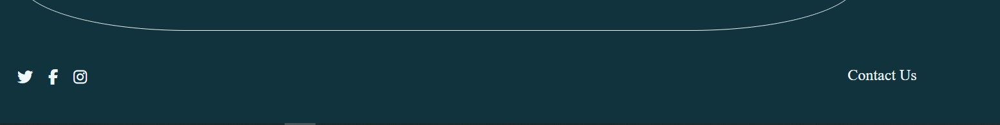

### Whole House Control
**Features:**
-   Controls for light, temperature, and fan.
-   User Stories Covered: 1, 2, 4, 5

Whole House Control

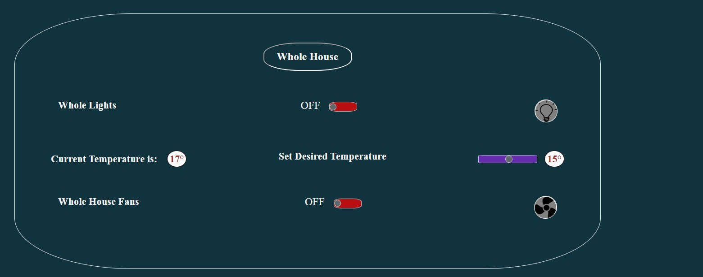

### Kitchen Control
**Features:**
-   Controls for light and fan.
-   User Stories Covered: 1, 4, 5

Kitchen Control

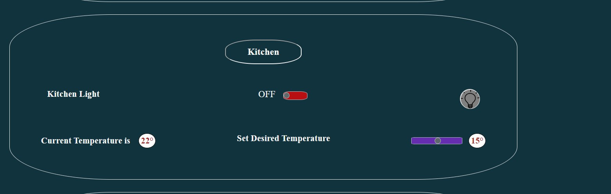

### Living Room Control
**Features:**
-   Two separate light controls.
-   Temperature display and slider to set the desired temperature.
-   Fan control with a three-speed slider.
-   User Stories Covered: 1, 2, 3, 4, 5

Living Room Control

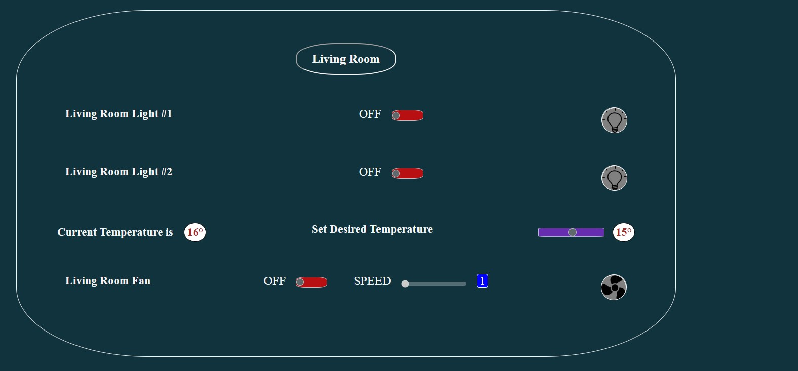

### Bedroom Control
**Features:**
-   Controls for light and temperature.
-   User Stories Covered: 1, 2, 4, 5

Bedroom Control

### Garage Control
**Features:**
-   Control for light.
-   User Stories Covered: 1, 4, 5

Garage Control

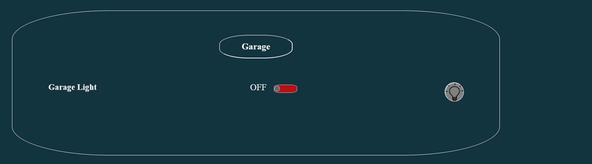

### Contact Form
**Features:**
-   Allows users to provide feedback and report issues.
-   User Story Covered: 7

Contact Form

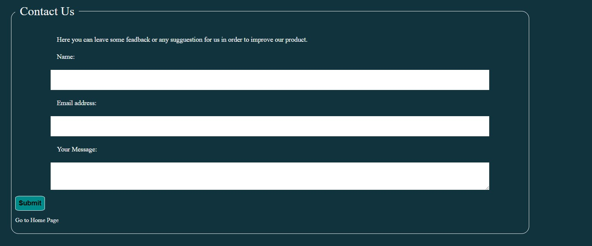

### Form Confirmation
**Features:**
-   Provides feedback to users after form submission with a button -    to return to the main interface.
-   User Story Covered: 6

Form Confirmation

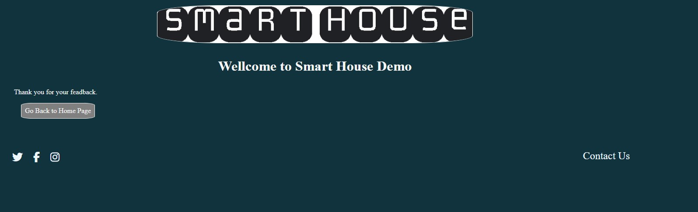

### 404 Message
**Features:**
-   Provides a way for users to return to the main interface after encountering a broken link.
-   User Story Covered: Ensures smooth navigation and user experience even when errors occur.

404 Message

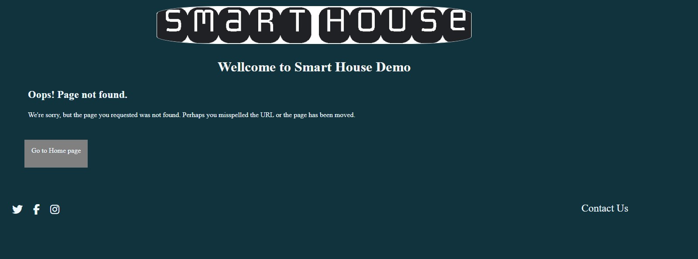

Each feature is designed to provide a seamless and intuitive experience, ensuring that users can efficiently control various aspects of their smart home environment.

[Go Back to Table of Contents](#table-of-contents)

---
##   Testing
### Validation
**HTML:** For validating our HTML codes, the W3C Markup Validation Service has been used. In the all pages there is no error.
   

HTML Validation Home

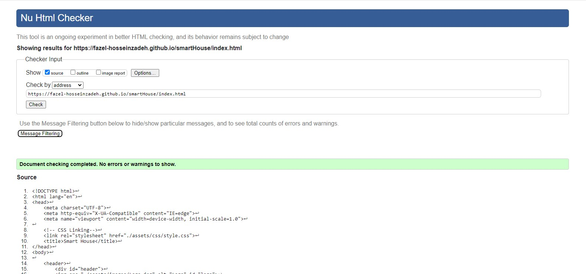

HTML Validation Contact

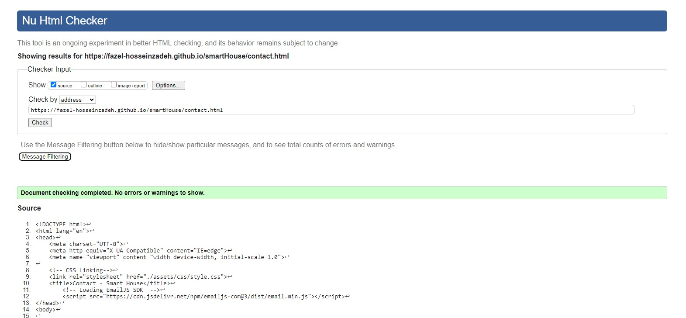

HTML Validation 404

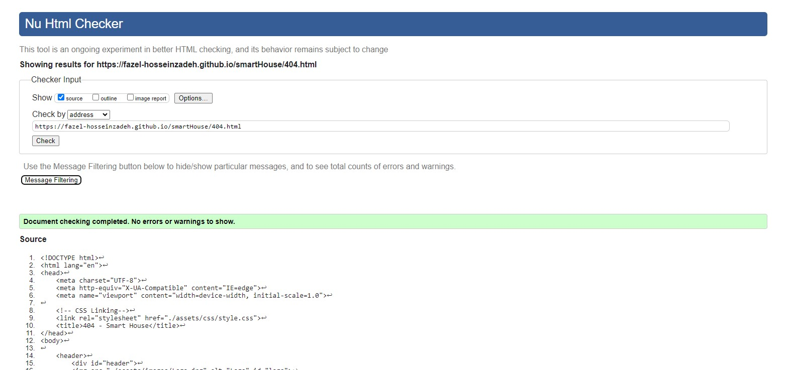

**CSS:** For validating our CSS codes, the W3C CSS Validation Service - Jigsaw has been used. It passed the test without any error.

CSS Validation

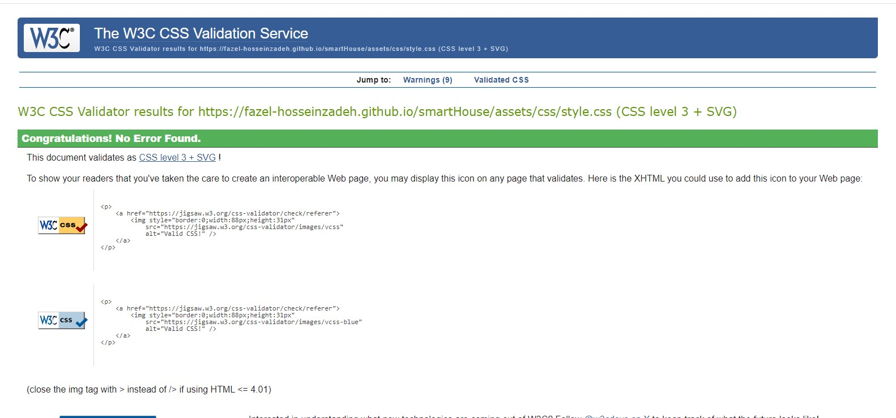

**JavaScript:** JSHint Static Code Analysis Tool for JavaScript has been used to validate the Javascript codes. No significant issues were found.

JS Validation

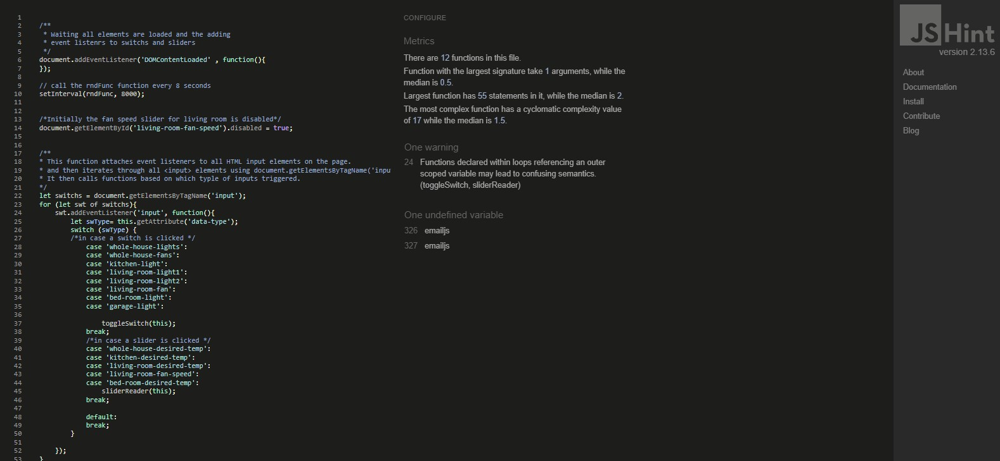

**Accessibility:** The WAVE WebAIM web accessibility evaluation tool has been used to ensure the website met high accessibility standards. All pages pass without errors.

Home

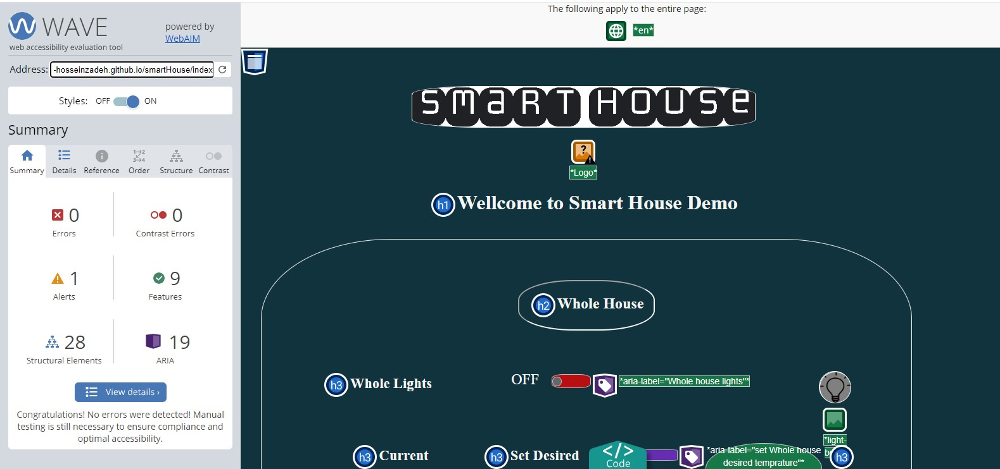

Contact

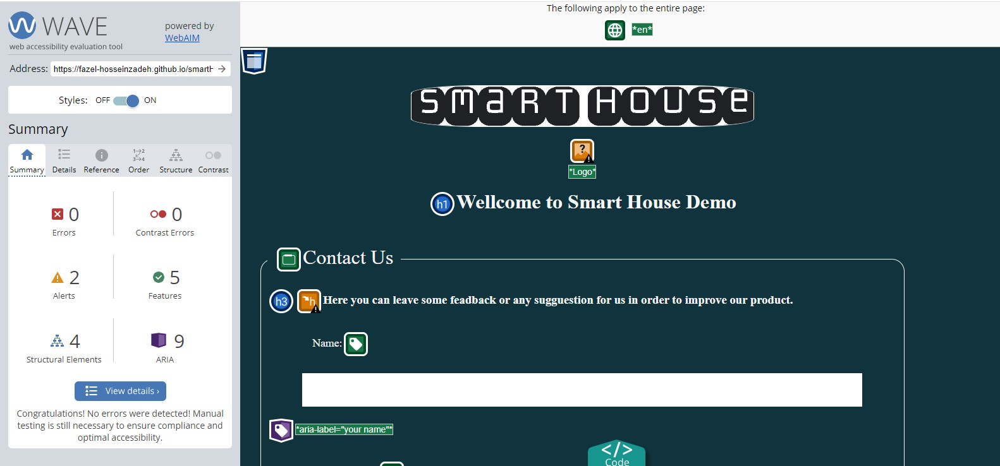

404

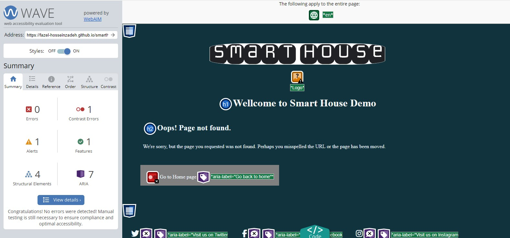

### Performance:
-   Performance has been tested using Google Lighthouse in Google Chrome Developer Tools.

Home

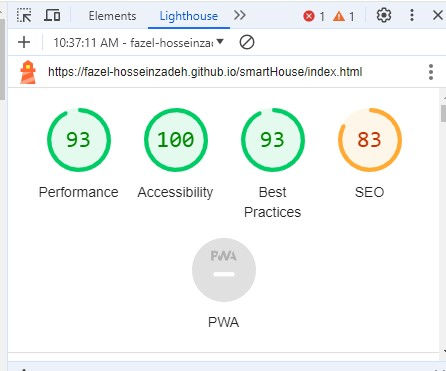

Contact

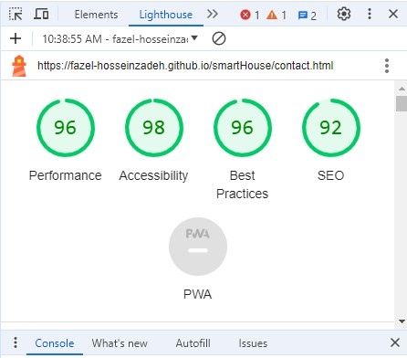

404

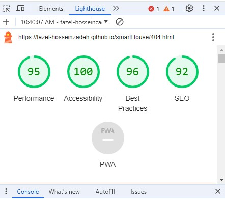

### Tests on devices:

-   Laptop : HP Elitebook 840 G3 (OS: Win10)
-   Tablet: Lenovo  TB-X505F (OS: Android 10)
-   Phone: SAmsung Galasy A7 (Os: Android 9)

the website performed smoothly on all devices above.

### Browser Compatability
The website was tested on the following browsers:

-   Google Chrome
-   Mozilla Firefox
-   Microsoft Edge

### Testing User Stories
-   As a user, I want to be able to turn the lights on and off in any room easily.
    +   Feature: Light Control
    +   Action: Toggle the light switch in the user interface
    +   Expected Result: The light in the selected room turns on or off
    +   Actual Result: Works as expected

-   As a user, I want to view the current temperature and set my desired temperature.
    +   Feature: Temperature Control
    +   Action: View the temperature display and adjust the temperature slider or input
    +   Expected Result: The current temperature is displayed, and the desired temperature is set
    +   Actual Result: Works as expected

-   As a user, I want to control the fan speed in the living room.
    +   Feature: Fan Speed Control
    +   Action: Adjust the fan speed slider
    +   Expected Result: The fan speed in the living room changes according to the slider setting
    +   Actual Result: Works as expected

-   As a user, I want the interface to be responsive and functional on my smartphone.
    +   Feature: Responsive Design
    +   Action: Access the user interface on a smartphone
    +   Expected Result: The interface adjusts to fit the smartphone screen and remains fully functional
    +   Actual Result: Works as expected

-   As a user, I want feedback confirming that my control actions (like turning on a light) have been executed.
    +   Feature: Action Feedback
    +   Action: Perform a control action (e.g., turning on a light)
    +   Expected Result: A feedback indicator like turne the lihgt bulb in the interface shows that the action has been executed
    +   Actual Result: Works as expected

-   As a user, I want to navigate between different rooms smoothly to control various devices.
    +   Feature: scrolling up and down on the page to reach out the desired section to control
    +   Action: Use the navigation menu to switch between different rooms
    +   Expected Result: The interface switches to the selected room, displaying its controls
    +   Actual Result: Works as expected

-   As a site owner, I want users to be able to contact us with suggestions or issues they encounter.
    +   Feature: Contact Form
    +   Action: Navigate to the contact form and submit feedback or issues
    +   Expected Result: The form is submitted, and a thank you message is displayed
    +   Actual Result: Works as expected

-   As a site owner, I want users to find information about our smart home solutions on social media platforms.
    +   Feature: Social Media Links
    +   Action: Scroll down to the footer section and click social media links
    +   Expected Result: Users are redirected to the relevant social media pages
    +   Actual Result: Works as expected

-   As a site owner, I want to showcase the seamless integration and functionality of smart home controls.
    +   Feature: Integrated Control Showcase
    +   Action: Navigate through various control options and use them
    +   Expected Result: All control options function seamlessly, demonstrating integration and ease of use
    +   Actual Result: Works as expected

These user stories were tested thoroughly to ensure that all functionalities work as expected, providing a seamless user experience.

[Go Back to Table of Contents](#table-of-contents)

---
##   Bugs
-   Social media links are not visible on contact and 404 page.
    +   fix: Add missing FontAwesome kit to the pages
-   On some tablets, whitespace below the footer appears
    +   Add CSS to make the pages min-height: 100vh and allow the main element to grow, but not to shrink

[Go Back to Table of Contents](#table-of-contents)

---
##   Deployment

The website was deployed using GitHub Pages. Here's a step-by-step guide on how it was done:

1.  Access the GitHub Repository Settings:

    -   Navigate to the GitHub repository you want to deploy.
    -   Click on the "Settings" tab at the top of the repository page.
2.  Configure GitHub Pages:

    -   In the left-hand sidebar, select "Pages".
    -   In the "Source" section, choose "Branch: main" (or "master", depending on your default branch).
    -   Save your changes. The page will automatically refresh.
3.  Confirm Deployment:

-   After a moment, a notification will appear at the top of the "Pages" settings section indicating that your site is published. It will provide the URL where your site is live (e.g., https://yourusername.github.io/your-repository).

To fork the repository:

1.  Fork the Repository:
    -   Go to the GitHub repository you want to fork.
    -   Click the "Fork" button in the upper right corner of the page.

To clone the repository locally:

1.  Clone the Repository:
-   Go to the GitHub repository you want to clone.
-   Click the "Code" button located above the list of files.
-   Choose your preferred method (HTTPS, SSH, or GitHub CLI) and click the copy button to copy the repository URL.
-   Open your terminal (Git Bash or any other terminal you use).
-   Change the current working directory to the location where you want the cloned directory.
-   Type git clone followed by the copied URL (e.g., git clone https://github.com/YOUR-USERNAME/YOUR-REPOSITORY).
-   Press Enter to create the local clone.

To integrate EmailJS API:

1.  Create an Account and Setup EmailJS:

-   Sign up for an account at EmailJS.
-   In your EmailJS dashboard, add a new email service and note the service ID.
-   reate a new email template and note the template ID.
-   Go to the integration settings and note your user ID.

2.  Include EmailJS in Your Project:
-   Load the EmailJS SDK by adding the script to the `<head>` section of your HTML file:
`
`
-   In JavaScript create a function that listens to a submit event and then initializes the SDK with your user id (`emailjs.init('YOUR_USER_ID');`) and submits the form `(emailjs.sendForm('contact_service', 'contact_form', this);)`

[Go Back to Table of Contents](#table-of-contents)

---
##   Credits 

### Code
-   CSS code to avoid whitespace below footer was taken from a forum post on FreeCodeCamp https://forum.freecodecamp.org/t/footer-white-space-below/191360/4

-PNG pictures used in this project: [www.freepik.com](www.freepik.com)

[Go Back to Table of Contents](#table-of-contents)

---
##  Acknowledgments
-   My mentor Mo Shami for his feedback, advice and support.

[Go Back to Table of Contents](#table-of-contents)

---

